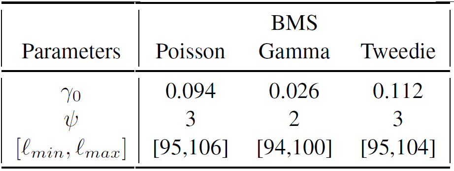
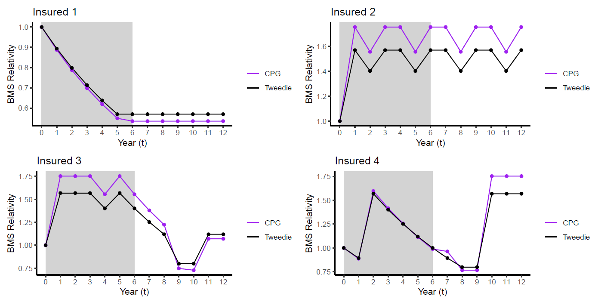

```{r include = F}
library(tidyverse)
library(xaringan)
library(xaringanthemer)
library(kableExtra)
library(DT)
library(dplyr)
library(ggplot2)
library(kableExtra)
library(scales)
library(MASS)
library(gamlss)

load('Data/df2.Rda')

```

class: title-slide
background-image: url(images/logo_chaire.jpg), url(images/background.jpg)
background-size: 25%, cover
background-position: 98% 98%, center

.titre-page-titre[An Overview of Bonus-Malus Scales Models for Predictive Ratemaking]
<br />
.sous-titre-page-titre[Georgia State University (GSU)]
<br />
***
<br />
.sous-sous-titre-page-titre[.mon-style-bleu[] Prof. Jean-Philippe Boucher, ACIA, Ph.D. <br /> .mon-style-bleu[] Co-operators Chair in Actuarial Risk Analysis <br /> Université du Québec à Montréal (UQAM) <br /> .mon-style-bleu[] November, 2023]


---

background-image: url("images/Paper1.png")
background-position: 80% 50%
background-size: 35%

# References 

.pull-left[
### The first part of the presentation is based on: 

>J.-P. Boucher (2022). Bonus-Malus Scale Models: Creating Artificial Past Claims History. *Annals of Actuarial Science*, 1-27. ]

---

background-image: url("images/Paper2.png")
background-position: 80% 50%
background-size: 35%

# References 

.pull-left[
### The second part of the presentation is based on: 

>J.-P. Boucher (2022). Multiple Bonus-Malus Scale Models for Insureds of Different Sizes. *Risks*, 10(8), 152. ]

---

background-image: url("images/Paper3.png")
background-position: 80% 50%
background-size: 35%

# References 

.pull-left[
### Finally, the last part of the presentation is based on: 

>J.-P. Boucher & **R. Coulibaly** (2023). Bonus-Malus Scale Premiums for Tweedie’s Compound Poisson Models. *Submitted*.

(we just submitted this paper last week!)]

---


# Introduction 

## Ratemaking with Cross-Section Data  
- Basic Count Distributions;
- Credibility Models and Predictive Ratemaking;
- Bonus-Malus Scales Models.

## Ratemaking with Panel Data  
- Families of Count Distributions;
- Observed Predictive Premiums;
- Bonus-Malus Scales Models Revisited.

## Actual Challenges
- Penalties and *a priori* risks.
- Loss Costs and Claim Severity.


---

class: inverse

# Part I: Ratemaking with cross-section data

## i) Basic count distributions

---

# Classic insurance database (cross-section data)

```{r, echo=FALSE, warning=FALSE}
tempo <- df2[sample(1:nrow(df2)), 1:24]
knitr::kable(head(tempo), format = "html", table.attr = "style='width:95%;'") %>% scroll_box(width = "100%")
```

---

# Available covariates

Many fictional covariates are available in the dataframe.  

For illustration, we will however only focus on 4 (fictional) covariates to model the number of claims:

```{r, echo=FALSE, cache=FALSE, warning=FALSE}
test <- data.frame(colnames(df2[,c(18,14,12,20)]))
list <- c(18,14,12,20)
test$value <- NA
for(i in 1:4){
  num <- list[i]
 # crossdata <- df2[order(df2[,num]),]
  crossdata <- df2
  test[i,2] <- paste(c(unique(df2[,num])))
}
test$value <- sub('c','',test$value)

colnames(test)[1] <- 'Column'
colnames(test)[2] <- 'Values'
knitr::kable(test, format = "html", row.names = F, table.attr = "style='width:95%;'") 
```


---

# Summary of the data (claims frequency)

## Basic statistics

```{r, echo=FALSE, warning=FALSE}
res <- df2 %>%
  group_by(NbClaims) %>%
  summarize(expo = sum(risk_expo),
            nb = n()) 
res$pctexpo <- res$expo/sum(res$expo)
res$pctnb <- res$nb/sum(res$nb)
res$pctexpo <- percent(res$pctexpo, accuracy = 0.1)
res$pctnb <- percent(res$pctnb, accuracy = 0.1)

res <- res[,c(1,3,5,2,4)]
colnames(res)[1] <- 'Nb. of Claims'
colnames(res)[2] <- 'Nb. of obs.'
colnames(res)[3] <- '% of obs.'
colnames(res)[4] <- 'Total exposition'
colnames(res)[5] <- '% of exposition'

knitr::kable(res, format = "html", align = "ccccc",  digits = c(0,0,0, 0,0), table.attr = "style='width:95%;'", format.args = list(big.mark = ",")) 

mean <- mean(crossdata$NbClaims)
variance <- sd(crossdata$NbClaims)^2

test <- data.frame(c(mean, variance))

colnames(test)[1] <- ''
rownames(test)[1] <- 'Mean'
rownames(test)[2] <- 'Variance'

knitr::kable(test, format = "html", digits = c(3), table.attr = "style='width:95%;'") 
```


---


# Ratemaking

## Premium calculation

For a specific insured $i$, our purpose is to model: 

- The number of claims $N_i$, for $i=1, \ldots, m$ (a.k.a. frequency);
- The severity of claims $j$, $X_{i,j}$, for $j=1, \ldots, N_i$, and $i=1, \ldots, m$ (a.k.a. severity);
- The total cost $S_{i}$, for $i=1, \ldots, m$.

We will usually suppose that the pure premium of each component if computed using the expected value.  

## Risk segmentation

With many covariates available, the premium of each insured could also be affected by its risk characteristics.

---

# Basis of covariates selection

## Techniques

- Minimum-bias techniques;  
- Generalized linear models;
- GLM-net (Ridge and Lasso);  
- Random Forests;  
- Neural Networks;  
- etc.  

## Literature review

- Denuit, M., Hainaut, D. & Trufin, J. (2019). *Effective statistical learning methods for actuaries I: GLMs and Extensions*, Springer Nature.
- Denuit, M., Hainaut, D. & Trufin, J. (2019). *Effective statistical learning methods for actuaries II: Tree-Based Methods and Extensions*, Springer Nature.
- Denuit, M., Hainaut, D. & Trufin, J. (2019). *Effective statistical learning methods for actuaries III: Neural Networks and Extensions*, Springer Nature.
- Wüthrich, M. V., & Merz, M. (2023). *Statistical foundations of actuarial learning and its applications*. Springer Nature.

---

# *A priori* ratemaking for claims frequency

## Poisson distribution

Commonly, the starting point for the modeling the number of claims is the Poisson distribution:

$$\Pr[N_{i}= n_{i}|\boldsymbol{X}_i] = \frac{\lambda_{i}^{n_{i}} e^{-\lambda_{i}}}{n_{i}!} \ 
\text{, with } \ \ \lambda_{i} = \exp(\boldsymbol{X}_{i}' \boldsymbol{\beta}).$$

With $E[N_i] = \lambda_i$, this form of ratemaking is usually called *a priori* ratemaking. In this framework, the actuary does not consider the past claim experience of the insureds.  

## Alternatives

To correct the equidispersion of the Poisson or other problems, the most popular alternatives to the Poisson are:

- Negative binomial (NB2 or NB1);
- Poisson-inverse gaussian (PIG2 or PIG1);
- Poisson-lognormal (PLN2 or PLN1);
- Zero-Inflated distributions.

---

class: inverse

# Part I: Ratemaking with cross-section data

## ii) Credibility models and predictive Ratemaking

---


# Predictive ratemaking

## Conditional expected value

The insurer is also interested in a premium that considers past contracts: 

$$E[N_{i,T}|n_{i,1},...,n_{i,T-1}, \boldsymbol{X}_{i, (1:T-1)}].$$ 

## Problem with cross-section data

- We suppose an independance between each line of the dataset;
- We do not directly observe the claim experience of an insured for his 2nd, 3rd, ..., contracts.

## Classic assumption (Bühlmann, 1967)

We suppose that each insured has his own random heterogeneity component (usually noted $\Theta$) that affects all his insurance contracts. 

---

# Gamma heterogeneity

If we suppose that $N_i|\Theta=\theta \sim Poisson(\lambda_i \theta)$, with $\Theta \sim gamma(\alpha, \tau = \alpha)$, we have:

$$\Pr[N_i=n] =  \int_0^{\infty} \frac{(\lambda_i \theta)^{n} e^{-\lambda_i \theta}}{n!} \frac{\alpha^{\alpha}}{\Gamma(\alpha)} \theta^{\alpha - 1} e^{-\alpha \theta} d\theta $$
## Negative binomial 2 distribution

It can be shown that the Poisson-gamma leads to the NB2, having the following probability function:

$$\Pr[N_i=n] = \binom{\alpha + n - 1}{n} \left(\frac{\alpha}{\lambda_i + \alpha}\right)^{\alpha} 
\left(\frac{\lambda_i}{\lambda_i + \alpha}\right)^{n}$$

## Moments

The NB2 has and expected value of $E[N_i] = \lambda_i$ and a variance $Var[N_i] = \lambda_i + \frac{\lambda_i^2}{\alpha}$, which means that the NB2 allows for overdispersion.

---

# Bayesian approach 

The addition of an heterogeneity term leads to the famous credibility models of Buhlmann or Buhlmann-Straub (exam C, or STAM).

## Predictive premium

It becomes possible to express the predictive premium based on the past number of claims $n$, and the past values of $\lambda$ : 

$$E[N_{i,T}|n_{i,1},..., n_{i,T-1}, \boldsymbol{X}_{i,T}] = \lambda_{i,T} \frac{\alpha + \sum_{t=1}^{T-1} n_{i,t}}{\alpha + \sum_{t=1}^{T-1} \lambda_{i,t}}$$ 

Even if the actuary cannot directly observe the average predictive value with the data, he is able to compute predictive premiums at the cost of making the constact random effect assumption.  

---

# R scripts: Poisson GLM

## Split data 

```{r, eval=TRUE}

db.train <- df2 %>% filter(Type=='TRAIN')
db.test <- df2 %>% filter(Type=='TEST')

```

## Poisson GLM 

```{r, eval=TRUE}
score.nbclaim <- as.formula(NbClaims ~ car_color + need_glasses + territory + language + food + offset(log(risk_expo)))
Poisson   <- glm(score.nbclaim, family=poisson(link=log), data=db.train)
```

---

# R scripts: Negative Binomial 2

## Packages to use 

You can directly estimate the parameters by maximum likelihood by maximising the log-probability, or you can use R packages.  The *MASS* package (or the *gamlss*, for example) can be used to estimate the parameters of a NB2 distribution:

```{r, eval=FALSE}
library(MASS)
```


```{r, eval=FALSE}
nb2.MASS <- glm.nb(score.nbclaim, data=db.train) 
```

```{r include = F}
nb2.MASS <- glm.nb(score.nbclaim, data=db.train) 
```


---

# Results

## Comparison

```{r, echo=FALSE, warning=FALSE, message=FALSE}
parm <- Poisson$coefficients
MASS.parm <- c(nb2.MASS$coefficients, nb2.MASS$theta)
parm[9] <- NA
table <- cbind(parm, MASS.parm)
colnames(table)[1] <- 'Poisson'
colnames(table)[2] <- 'NB2'
rownames(table)[9] <- "$\\alpha$"
knitr::kable(table, format = "html", align = "ccccc",  digits = c(4,4), table.attr = "style='width:95%;'", format.args = list(big.mark = ",")) 

```

---

# Prediction quality on the test set

Even if it is not the objective of this presentation, we can compare the fit and the prediction quality of the Poisson and the Negative Binomial 2.  For the training set, the loglikelihood is used and a logarithmic score is used on the test set:

$$- \sum_{i=1}^m \log(\Pr(N_i=n_i|\boldsymbol{X}_i))$$

## Computation

```{r, echo=TRUE, warning=FALSE, message=FALSE}
db.test$pred <- predict(Poisson, newdata=db.test, type="response") 
logs.Poisson <- -sum(dpois(db.test$NbClaims, db.test$pred, log=TRUE))
ll.Poisson <- logLik(Poisson)

db.test$pred <- predict(nb2.MASS, newdata=db.test, type="response") 
alpha <- 1/nb2.MASS$theta
tau <- 1/nb2.MASS$theta
ll <- lgamma(db.test$NbClaims + alpha) - lgamma(alpha) - lgamma(db.test$NbClaims+1) + alpha*log(tau) - alpha*log(db.test$pred+tau) + db.test$NbClaims*log(db.test$pred) - db.test$NbClaims*log(db.test$pred+tau)
logs.NB2 <- -sum(ll)
ll.NB2 <- logLik(nb2.MASS)

```

---

# Comparison of models

## Results

```{r, echo=FALSE, warning=FALSE, message=FALSE}
table<- data.frame(cbind(c(ll.Poisson,ll.NB2), c(logs.Poisson,logs.NB2)))

colnames(table)[1] <- 'Log-likelihood (Train)'
colnames(table)[2] <- 'Logarithmic Score (Test)'
rownames(table)[1] <- 'Poisson'
rownames(table)[2] <- 'Negative Binomial 2'

knitr::kable(table, format = "html", align = "ccccc",  digits = c(4,4), table.attr = "style='width:95%;'", format.args = list(big.mark = ",")) 

```

---

# Predictive ratemaking

## Distribution of the heterogeneity

Based on the baysian model, by fitting a Negative Binomial distribution (NB2) on claim counts data, we know that the heterogeneity of our portfolio $\Theta$ is following a gamma( $\alpha = 1.6654$, $\tau = \alpha = 1.6654$).

## Predictive premiums

The predictive premium of an insured with $n_{i, \bullet} = \sum_{t=1}^{T-1} n_{i,t}$ past claims, and 
$\lambda_{i, \bullet} = \sum_{t=1}^{T-1} \lambda_{i,t}$ as the sum of past *a priori* premiums, is equal to:

$$E[N_{i,T}|n_{i,1},..., n_{i,T-1}, \boldsymbol{X}_{i,T}] = \lambda_{i,T} \frac{\alpha + \sum_{t=1}^{T-1} n_{i,t}}{\alpha + \sum_{t=1}^{T-1} \lambda_{i,t}} = \lambda_{i,T} \frac{1.6654 + n_{i, \bullet}}{1.6654 +  \lambda_{i,\bullet}}$$ 

In STAM exam, we were able to analyse in details this equation.

---

# Practical use

However, even if the Poisson-gamma model is theoretically correct, and even studied in the preliminary exams, this predictive rating approach is almost never used in practice:

- There is not weight in $\sum_{t=1}^{T-1} n_{i,t}$.  That means that a claim from 10 or 20 years ago will have the same impact of the premium that an accident that was claimed last year;  

- The value of $\sum_{t=1}^{T-1} \lambda_{i,t}$ depend on the estimated values of $\beta$, and should then be computed each year.  That means that insurers should keep all past covariates $\boldsymbol{X}_{i,t}$, from $t=1, \ldots, T$ of all their insureds.  For new insureds, this is even more complicated.

---

class: inverse

# Part I: Ratemaking with cross-section data

## iii) Bonus-Malus scales models

---


# Bonus-malus scales

To compute predictive premiums, actuaries have created **Bonus-Malus Scales** (BMS) models.  BMS are class systems where the insured's level $\ell$ increases or decreases only by the number of claims.

### Structure of the BMS (example with 6 levels)

```{r, echo=FALSE, warning=FALSE, message=FALSE}
table<- data.frame(cbind(c('6', '5', '4', '3', '2', '1'), c(1.41, 1.23, 1.14, 1.08, 1.02, 0.90)))

colnames(table)[1] <- 'Level'
colnames(table)[2] <- 'Relativities'

knitr::kable(table, format = "html", align = "cc", row.names = F,  digits = c(4,4), table.attr = "style='width:95%;'", format.args = list(big.mark = ",")) 

```

---

# Transition rules

A BMS is defined by its number of levels and by its transition rules.  If we suppose a BMS with $6$ levels (from 1 to 6), we can than create a BMS having the following rules:

- A new insured has an entry level $1$;    
- The BMS level of an insured without claim will be lowered by 1 (-1);    
- The BMS level of an insured will increase by the number of claims times 2 (+2).   

We then can summarize the transition rule system as:


```{r, echo=FALSE, warning=FALSE, message=FALSE}
start <- c(1,2,3,4,5,6)
s0 <- c(1,1,2,3,4,5)
s1 <- c(3,3,4,5,6,6)
s2 <- c(4,5,6,6,6,6)
s3 <- c(6,6,6,6,6,6)

table<- data.frame(cbind(start, s0, s1, s2, s3)) 

colnames(table)[1] <- 'Starting Level (time t)'
colnames(table)[2] <- 'x=0'
colnames(table)[3] <- 'x=1'
colnames(table)[4] <- 'x=2'
colnames(table)[5] <- 'x>3'

knitr::kable(table, format = "html", align = "ccccc", row.names = F,  digits = c(4,4), table.attr = "style='width:95%;'", format.args = list(big.mark = ",")) %>%
  add_header_above(c(" ", "Level at time t+1, if x claims" = 4))

```

---


# Transition matrix

This means that for a specific distribution, for example a Poisson or a NB2 distribution, it becomes possible to construct the transition matrix from time $t$ to time $t+1$.

```{r, echo=FALSE, warning=FALSE, message=FALSE}

s1 <- c('1','Pr(N=0)','0', 'Pr(N=1)','0', 'Pr(N=2)', 'Pr(N>2)')
s2 <- c('2','Pr(N=0)','0', '0','Pr(N=1)', '0', 'Pr(N>1)')
s3 <- c('3','0','Pr(N=0)', '0','0', 'Pr(N=1)', 'Pr(N>1)')
s4 <- c('4','0','0', 'Pr(N=0)','0', '0', 'Pr(N>0)')
s5 <- c('5','0','0', '0','Pr(N=0)', '0', 'Pr(N>0)')
s6 <- c('6','0','0', '0','0', 'Pr(N=0)', 'Pr(N>0)')

table<- data.frame(rbind(s1, s2, s3, s4, s5, s6)) 

colnames(table)[1] <- 'Level at time t'
colnames(table)[2] <- '1'
colnames(table)[3] <- '2'
colnames(table)[4] <- '3'
colnames(table)[5] <- '4'
colnames(table)[6] <- '5'
colnames(table)[7] <- '6'

knitr::kable(table, format = "html", align = "ccccc", row.names=F, table.attr = "style='width:95%;'", format.args = list(big.mark = ",")) %>%
  add_header_above(c(" ", "Level at time t+1" = 6))

```

---

# For more details

.pull-left-50[
>Denuit, M., Maréchal, X., Pitrebois, S., & Walhin, J. F. (2007). *Actuarial modelling of claim counts: Risk classification, credibility and bonus-malus systems*. John Wiley & Sons.  

<br />
```{r, echo = F, out.width = "40%", fig.align = "center"}

```
]

.pull-right-50[
>Lemaire, J. (1995). *Bonus-malus systems in automobile insurance (Vol. 19)*. Springer science & business media.  

<br />
<br />
```{r, echo = F, out.width = "40%", fig.align = "center"}

```

]

---

class: inverse

# Part II: Ratemaking with longitudinal data

## i) Families of count distributions

---

# Actual insurance database 

Insureds (or even vehicles) are observed over time.  Here, the dataframe *df2.Rda* contains 25,078 vehicles each observed for 5 years.

```{r, echo=FALSE, warning=FALSE}
knitr::kable(head(df2), format = "html", table.attr = "style='width:95%;'") %>% scroll_box(width = "100%")
```

---

# Claim count for panel data ##

## Families of models

We have to suppose a form of dependance between all contracts of the same insured/vehicle. For count distributions, panel data modeling admits 3 families (see Molenberghs & Verbeke, 2005):

- Transition models (for example: time series for count data);    
- Marginal approach (for example: Generalized Estimating Equations - GEE);  
- Conditional approach with random effects.

---

# Conditional approach

## General form 

In actuarial science, the conditional approach is the most popular approach. It that can be seen as a generalization of the heterogeneity approach seen earlier:

$$\Pr[N_{i,1}=n_{i,1},...,N_{i,T}=n_{i,T}] = \int_{D_{\Theta}} \left(\prod_{t=1}^T \Pr[N_{i,t}=n_{i,t}|\theta] \right) g(\theta) d\theta.$$

## The Poisson-gamma model revisited

A conditional Poisson distribution, with gamma random effects leads to the multivariate negative binomial distribution (MVNB), a generalization of the NB2 distribution:

$$\Pr[N_{i,1}=n_{i,1},...,N_{i,T}=n_{i,T}] = \left(\prod_{t=1}^{T} \frac{(\lambda_{i,t})^{n_{i,t}}}{n_{i,t}!} \right)
\frac{\Gamma(\sum_{t=1}^T n_{i,t} + \alpha)}{\Gamma(\alpha)} \left(\frac{\alpha}{\sum_{i=1}^T \lambda_{i,t} + \alpha}\right)^{\alpha}
\left(\sum_{i=1}^T \lambda_{i,t} + \alpha\right)^{-\sum_{t=1}^T n_{i,t}}.$$

---

# Posterior ratemaking

As for cross-section data, we are interested to compute the predictive premium. The predictive premium of an insured with $\sum_{t=1}^{T-1} n_{i,t}$ past claims, and $\sum_{t=1}^{T-1} \lambda_{i,t}$ as the sum of past *a priori* premiums, is equal to:

$$E[N_{i,T}|n_{i,1},..., n_{i,T-1}, \boldsymbol{X}_{i,T}] = \lambda_{i,T} \frac{\alpha + \sum_{t=1}^{T-1} n_{i,t}}{\alpha + \sum_{t=1}^{T-1} \lambda_{i,t}}.$$

This result is similar to what we obtained for the predictive premium of a NB2 distribution.

## Same problems 

For the same reasons why the NB2 was not used in practice (no weight in $\sum_{t=1}^{T-1} n_{i,t}$, and the need to use past $\lambda_{i,t}$, for example), another approach has to be used in practice.

As before, by knowing the distribution of the random effects $\Theta$, the Bonus-Malus Scale models can be an interesting solution...

---

class: inverse

# Part II: Ratemaking with longitudinal data

## ii) Observed predicted premiums

---


# Predictive distribution

Even if the situation is similar, cross-section data and panel data models are not the same. 

## Joint distribution

The joint distribution for all the contracts of the same insured can be rewritten as:

$$\Pr[N_{i,1}=n_{i,1},...,N_{i,T}=n_{i,T}] = \Pr[N_{i,1}=n_{i,1}] \times \Pr[N_{i,2}=n_{i,2}|n_{i,1}] \times \ldots \times \Pr[N_{i,T}=n_{i,T}|n_{i,1}, \ldots, n_{i,T-1}]$$

That means that the distribution the predictive distribution $\Pr[N_{i,t}=n_{i,t}|n_{i,1}, \ldots, n_{i,t-1}]$ is already used in the modeling and thus, a predictive premium is already computed in the underlying model.

## Assumption

We do not need to only rely on the assumption of the constant heterogeneity term to ccompute the predictive premium (even more for large longitudinal dataset - as for the farm insurance dataset used in the published papers).

---

# Empirical analysis 

We can indeed verify empirically the values of the predictive premiums (as a percentage of the average frequency).

```{r, echo = F, warning=FALSE, dpi=300, fig.width=13, fig.height=5.5, fig.align = "center"}
mean <- mean(df2$NbClaims)
data <- df2 %>%
  arrange(policy_no, veh.num, renewal_date) %>%
  group_by(policy_no, veh.num) %>%
  mutate(contract.no = row_number(),
         past.nbclaim = cumsum(NbClaims)- NbClaims) %>%
  ungroup()

somm1 <- data %>%
  group_by(contract.no, past.nbclaim) %>%
  summarise(nb = n(),
            freq = mean(NbClaims), .groups = 'drop') %>%
  mutate(pct = freq/mean) %>%
  ungroup()

ggplot(somm1, aes(as.factor(contract.no), as.factor(past.nbclaim), fill= as.numeric(pct))) + 
  geom_tile()+
  geom_text(aes(label = paste(sprintf("%0.1f", 100*pct),'%  (', sprintf("%0.0f", nb), ')') ), color = "black", size = 4) +
  scale_fill_gradient2(low = "green", mid = "gray", midpoint = 1, high = "red")+
  xlab("Contract nb.") + ylab("Nb. of past claims")+
  theme(legend.position = 'none')
```

---

class: inverse

# Part II: Ratemaking with longitudinal data

## iii) Bonus-Malus scales revisited

---

# Bonus-Malus scales

BMS are still interesting for actuaries and insurers:

- Advanced panel data models based on random effects, hierachical copulas, etc. cannot be easily used for ratemaking in practice;  
- The penalty structure of BMS are well-known by many insurers, brokers, regulators and insureds, and easy to explain/understand;
- BMS allow complex penalty structure that might be difficult to implement with classic statistical models:  
  - Fast-track for forgiveness (ex: for example: 3-5 years without claim automatically gives the largest discount);  
  - Multi-vehicules penalty structure;  
  - Multi-products penalty structure;  
  - etc.  
- There is a large scientific literature on BMS that can be used.

---

# The challenge with BMS

The problem is not on the BMS itself, but on how BMS can now be estimated with the current longitudinal/hierarchical data of 
insurers:
  - We do not have to rely on the long-term behaviour of the insureds, based on the heterogeneity distribution;
  - BMS relativities have to be estimated directly with the data;
  - A direct comparison between BMS premiums and data can be done.

Boucher & Inoussa (2014) were the first to be interested in adapting the Bonus-Malus Scales approach to the new databases of insurers.

In the following slides, a link between the classic GLM approach and the BMS is proposed to better understand how actuaries can estimated all the BMS parameters.

---

# Using past informations as covariates 

Instead of using the bayesian approach, with an unknown risk profile that be updated after each contract, many insurers directly include past claims information as covariate in the $\mu$ mean parameter of the count distribution.  

For example, for an insured with $T$ years of experience, some actuaries use:
	
$$\mu_{i,T}= \exp\left(X_{i,T}' \beta + \gamma_1 n_{i, T-1} + \gamma_2 n_{i, T-2} + ... +\gamma_1 n_{i, 1}\right)$$

## Sum of past claims
	
This means a large amount of parameters $\gamma_1, \ldots, \gamma_a$.  (One of) the purpose of statistics is to summarize information.
One classic approach is instead to use a summary of past claims.  For example, we can use:

$$\mu_{i,t}= \exp(X_{i,t}' \beta + \gamma n_{i, \bullet})$$

where $n_{i, \bullet}$ is the number of all past claims for insured $i$. 

---

# New insureds and insureds with experience

The problem with the last approach is that we cannot differentiate new insureds from insureds with many years of experience: both types of insureds have $n_{i, \bullet} = 0$. Instead, we should use:

$$\mu_{i,T}= \exp(\boldsymbol{X}_{i,T}' \beta + \gamma_1 \kappa_{i, \bullet} + \gamma_2 n_{i, \bullet})$$
	
where, for insured $i$:  
- $n_{i, \bullet} = \sum_{t=1}^{T-1} n_{i,t}$ is the number of all past claims;    
- $\kappa_{i, \bullet} = \sum_{t=1}^{T-1} I(n_{i,t}=0)$ is the sum of policy periods without claims.  

This allows us to differentiate new insureds from insureds with many years of experience.  
	
This model is called the **Kappa-N model**.

---

# Fitting the Kappa-N model 

The Kappa-N model can be used with any distribution.  The Poisson Kappa-N and the NB2 Kappa-N are presented below:

## Add past information

```{r, eval=TRUE}
data <- df2 %>%
  mutate(ind.0 = (NbClaims == 0)) %>%
  arrange(policy_no, veh.num, renewal_date) %>%
  group_by(policy_no, veh.num) %>%
  mutate(contract.no = row_number(),
         past.n = cumsum(NbClaims)- NbClaims, 
         past.kappa = cumsum(ind.0) - ind.0) %>%
  ungroup()
```

## Split data 

```{r, eval=TRUE}

db.train <- data %>% filter(Type=='TRAIN')
db.test <- data %>% filter(Type=='TEST')

```


---

# Poisson Kappa-N and NB2 Kappa-N models 

## Fitting models

```{r, eval=TRUE, cache=FALSE}
score.nbclaim <- as.formula(NbClaims ~ car_color + need_glasses + territory + language + food + past.n + past.kappa + offset(log(risk_expo)))
Poisson   <- glm(score.nbclaim, family=poisson(link=log), data=db.train)
nb2.MASS <- glm.nb(score.nbclaim, data=db.train) 
```

---

# Poisson Kappa-N and NB2 Kappa-N models 

```{r, echo=FALSE, warning=FALSE, message=FALSE}
parm <- Poisson$coefficients
parm[11] <- NA
MASS.parm <- c(nb2.MASS$coefficients, nb2.MASS$theta)
table <- cbind(parm, MASS.parm)
colnames(table)[1] <- 'Poisson'
colnames(table)[2] <- 'NB2(MASS)'
rownames(table)[11] <- '$\\alpha$'
knitr::kable(table, format = "html", align = "ccccc",  digits = c(4,4), table.attr = "style='width:95%;'", format.args = list(big.mark = ",")) 
```

---

# Estimated parameters 

The mean parameter of the Poisson and the NB2 distribution was defined as:
	
$$\lambda_{i,t}= \exp(X_{i,t}' \beta + \gamma_1 \kappa_{i, \bullet} + \gamma_2 n_{i, \bullet})$$

## Results for the fictive car insurance dataset:

For the Poisson distribution, we obtained:

- $\widehat{\gamma}_1$ = $0.1976$;   
- $\widehat{\gamma}_2$ = $-0.1101$.

## Results for the Farm dataset (in the published papers):

For the Poisson distribution, we obtained:

- $\widehat{\gamma}_1$ = $0.0935$;   
- $\widehat{\gamma}_2$ = $-0.0238$.  

---

# Rewriting the model

We can rewrite the Kappa-N model with the following steps:

1- Instead of using $\kappa_{i, \bullet}$ as a covariate, we used a slightly modified transformation: $100 - \kappa_{i, \bullet}$.  
  - The negative value in front of $\kappa_{i, \bullet}$ helps to understand that high values of contracts without claim should decrease the premium;
  - The value of $100$ will be used as the entry level for insureds without experience.

$$\lambda_{i,t} = \exp\left(\boldsymbol{X}_{i,t}' \beta^* + \gamma_1 (100 -\kappa_{i, \bullet}) + \gamma_2 n_{i, \bullet} \right)$$


2- We factor out the parameter $\gamma_1$ to obtain:

$$\lambda_{i,t} = \exp\left(\boldsymbol{X}_{i,t}' \beta^* + \gamma_1 \left(100 -\kappa_{i, \bullet} + \frac{\gamma_2}{\gamma_1} n_{i, \bullet} \right) \right) = \exp\left(\boldsymbol{X}_{i,t}' \beta^* + \gamma_1 \ell_{i,t} \right)$$

where the parameter $\ell_{i,t} = \left(100 -\kappa_{i, \bullet} + \frac{\gamma_2}{\gamma_1} n_{i, \bullet} \right)$ can be seen as a $\textbf{claim score}$.


---

# Penalty structure 

With the mean parameter:

$$\lambda_{i,t} = \exp\left(\boldsymbol{X}_{i,t}' \beta^* + \gamma_1 \ell_{i,t} \right) \text{, where } \ell_{i,t} = \left(100 -\kappa_{i, \bullet} + \frac{\gamma_2}{\gamma_1} n_{i, \bullet} \right)$$

## Details 

1) For new insured, without insured experience, we have $n_{i, \bullet} = 0$, and $\kappa_{i, \bullet} = 0$, which means an initial claim score of 100.  
  
2) Each year without claim decrease his claim score by 1.  

3) Each claim increases the claim score by $\Psi = \frac{\widehat{\gamma_2}}{\widehat{\gamma_1}} = 3.93$, called the *jump-parameter*:  
  - One claim equals $\approx \Psi$ years without claims;
  - $\Psi = \frac{0.1976}{0.1101} = 1.79$ for the fictive car insurance dataset.

---

# Penalty structure (2)

With the mean parameter:

$$\lambda_{i,t} = \exp\left(\boldsymbol{X}_{i,t}' \beta^* + \gamma_1 \ell_{i,t} \right) \text{, where } \ell_{i,t} = \left(100 -\kappa_{i, \bullet} + \frac{\gamma_2}{\gamma_1} n_{i, \bullet} \right)$$

## Details 

4) The penalty for a claim is equal to:
  - $\exp(0.1101 \times 1.79) - 1  = 21.78\%$ for the fictive car insurance dataset.

5) Each year without claim decreases the premium by:
  - $1 - \exp(-0.1101) = 10.4\%$ for the fictive car insurance dataset.	

---


# Problem of the Kappa-N models

One obvious problem with the Kappa-N models is the possible extreme values of $\ell_{i,t}$.  For the fictive dataset, we have: 

1) Maximum value of $n_{i, \bullet}$: 8.    

2) Maximum value for $\ell_{i,t}$: 114.4     
  - Results in a premium almost 4 times higher than the premium for a new insured;  
  - It would take 14 consecutive years without claim for this insured to have the same premium as a new insured.

3) Minimum value for $\ell_{i,t}$: 96.  
  - Discount of $35\%$.  

---

# A possible solution

One solution could be to limit the value of $\ell_{i,t}$ in the modeling.  

For example, we can limit $\ell_{i,T}$ to be between 95 and 110, meaning $\ell_{min}=98$ and $\ell_{max}=105$:

- Instead of $\ell_{i,T} = 114.4$, an insured would have $\ell_{i,T}= 105$
  - ...but it would however still need him 14 consecutive years without claim to reach level 100!  

- Instead of $\ell_{i,T} = 96$, the insured without claim would have $\ell_{i,T}= 98$
  - ...but it means that he could claim without having any surcharge!  


---

# A better solution

Instead of:  
- limiting the claim score $\ell_{i,t}$ for **the current contract** $t=T$,   
- we could limit the value of the claim score $\ell_{i,t}$ but for **all past contracts** $t=1, \ldots, T$. 

## Simple illustration 

What happens to the claim score with a jump parameter $\Psi=3$.

```{r, echo=FALSE, warning=FALSE, message=FALSE}
s0 <- c(0,0,0,0,0,0,0,0,0,0)
s1 <- c(2,0,1,0,0,0,2,0,1,0)
s2 <- c(4,1,2,0,0,0,0,0,0,0)

table<- data.frame(rbind(s0, s1, s2)) 

colnames(table)[1] <- '1'
colnames(table)[2] <- '2'
colnames(table)[3] <- '3'
colnames(table)[4] <- '4'
colnames(table)[5] <- '5'
colnames(table)[6] <- '6'
colnames(table)[7] <- '7'
colnames(table)[8] <- '8'
colnames(table)[9] <- '9'
colnames(table)[10]<- '10'
rownames(table)[1] <- 'Insured 1'
rownames(table)[2] <- 'Insured 2'
rownames(table)[3] <- 'Insured 3'

knitr::kable(table, format = "html", align = "ccccc", table.attr = "style='width:95%;'", format.args = list(big.mark = ",")) %>%
  add_header_above(c("", "Number of claims at time (t)" = 10))

```


---


```{r, echo=FALSE, warning=FALSE, message=FALSE}

time <- seq(1:10)
s0 <- c(0,0,0,0,0,0,0,0,0,0)
s1 <- c(2,0,1,0,0,0,2,0,1,0)
s2 <- c(4,1,2,0,0,0,0,0,0,0)

table<- data.frame(cbind(time, s0, s1, s2)) 
colnames(table) <- c('time', 'nb1', 'nb2', 'nb3')
table$l1 <- NA
table$l2 <- NA
table$l3 <- NA

jump <- 3

lev1 <- 100
lev2 <- 100
lev3 <- 100
for(i in 1:10){
  table[i,5] <- lev1
  table[i,6] <- lev2
  table[i,7] <- lev3
  lev1 <- lev1 + jump*table[i,2] - (table[i,2]==0) 
  lev2 <- lev2 + jump*table[i,3] - (table[i,3]==0)
  lev3 <- lev3 + jump*table[i,4] - (table[i,4]==0)
}

g1<- ggplot() +
  geom_line(aes(x=time, y=l1), color='red', data=table)+
  geom_point(aes(x=time, y=l1), color='red', data=table)+
  geom_line(aes(x=time, y=l2), color='blue', data=table)+
  geom_point(aes(x=time, y=l2), color='blue', data=table)+ 
  geom_line(aes(x=time, y=l3), color='darkgreen', data=table)+
  geom_point(aes(x=time, y=l3), color='darkgreen', data=table)+
  scale_x_discrete(limits=1:10)+
  ylab("Claim Score") +
  xlab("Time") +
  ylim(90, 122)+
  theme_bw()


g2 <- ggplot() +
  geom_line(aes(x=time, y=l1), color='red', data=table)+
  geom_point(aes(x=time, y=l1), color='red', data=table)+
  geom_line(aes(x=time, y=l2), color='blue', data=table)+
  geom_point(aes(x=time, y=l2), color='blue', data=table)+ 
  geom_line(aes(x=time, y=l3), color='darkgreen', data=table)+
  geom_point(aes(x=time, y=l3), color='darkgreen', data=table)+
  geom_hline(yintercept=110, linetype="dashed", color = "black") +
  geom_hline(yintercept=95, linetype="dashed", color = "black") +
  geom_point(aes(x=10, y=110), color='blue', size=2, data=table)+
  geom_point(aes(x=10, y=110), color='darkgreen', size=2, data=table)+
  geom_point(aes(x=10, y=95), color='red', size=2, data=table)+
  scale_x_discrete(limits=1:10)+
  ylab("Claim Score") +
  xlab("Time") +
  ylim(90, 122)+
  theme_bw()


lev1 <- 100
lev2 <- 100
lev3 <- 100
for(i in 1:10){
  table[i,5] <- lev1
  table[i,6] <- lev2
  table[i,7] <- lev3
  lev1 <- lev1 + jump*table[i,2] - (table[i,2]==0) 
  lev2 <- lev2 + jump*table[i,3] - (table[i,3]==0)
  lev3 <- lev3 + jump*table[i,4] - (table[i,4]==0)
  lev1 <- min(max(lev1, 95), 110)
  lev2 <- min(max(lev2, 95), 110)
  lev3 <- min(max(lev3, 95), 110)
}

g3 <- ggplot() +
  geom_line(aes(x=time, y=l1), color='red', data=table)+
  geom_point(aes(x=time, y=l1), color='red', data=table)+
  geom_line(aes(x=time, y=l2), color='blue', data=table)+
  geom_point(aes(x=time, y=l2), color='blue', data=table)+ 
  geom_line(aes(x=time, y=l3), color='darkgreen', data=table)+
  geom_point(aes(x=time, y=l3), color='darkgreen', data=table)+
  geom_hline(yintercept=110, linetype="dashed", color = "black") +
  geom_hline(yintercept=95, linetype="dashed", color = "black") +
  scale_x_discrete(limits=1:10)+
  ylab("Claim Score") +
  xlab("Time") +
  ylim(90, 122)+
  theme_bw()

g3b <- ggplot() +
  geom_line(aes(x=time, y=l1), color='red', data=table)+
  geom_point(aes(x=time, y=l1), color='red', data=table)+
  geom_line(aes(x=time, y=l2), color='blue', data=table)+
  geom_point(aes(x=time, y=l2), color='blue', data=table)+ 
  geom_line(aes(x=time, y=l3), color='darkgreen', data=table)+
  geom_point(aes(x=time, y=l3), color='darkgreen', data=table)+
  geom_hline(yintercept=110, linetype="dashed", color = "black") +
  geom_hline(yintercept=95, linetype="dashed", color = "black") +
  scale_x_discrete(limits=1:10)+
  ylab("Claim Score") +
  xlab("Time") +
  ylim(90, 115)+
  theme_bw()

jump <- 4
lev1 <- 100
lev2 <- 100
lev3 <- 100
for(i in 1:10){
  table[i,5] <- lev1
  table[i,6] <- lev2
  table[i,7] <- lev3
  lev1 <- lev1 + jump*table[i,2] - (table[i,2]==0) 
  lev2 <- lev2 + jump*table[i,3] - (table[i,3]==0)
  lev3 <- lev3 + jump*table[i,4] - (table[i,4]==0)
  lev1 <- min(max(lev1, 92), 112)
  lev2 <- min(max(lev2, 92), 112)
  lev3 <- min(max(lev3, 92), 112)
}

g4 <- ggplot() +
  geom_line(aes(x=time, y=l1), color='red', data=table)+
  geom_point(aes(x=time, y=l1), color='red', data=table)+
  geom_line(aes(x=time, y=l2), color='blue', data=table)+
  geom_point(aes(x=time, y=l2), color='blue', data=table)+ 
  geom_line(aes(x=time, y=l3), color='darkgreen', data=table)+
  geom_point(aes(x=time, y=l3), color='darkgreen', data=table)+
  geom_point(aes(x=10, y=95), color='red', size=2, shape=15)+
  geom_point(aes(x=10, y=110), color='blue', size=2, shape=15)+
  geom_point(aes(x=10, y=104), color='darkgreen', size=2, shape=15)+
  geom_hline(yintercept=112, linetype="dashed", color = "black") +
  geom_hline(yintercept=92, linetype="dashed", color = "black") +
  scale_x_discrete(limits=1:10)+
  ylab("Claim Score") +
  xlab("Time") +
  ylim(90, 115)+
  theme_bw()


 
```

# How to limit the claim score

```{r, echo = F, warning=FALSE, dpi=300, fig.width=13, fig.height=5.5, fig.align = "center"}

g1

```


---

# How to limit the claim score

```{r, echo = F, warning=FALSE, dpi=300, fig.width=13, fig.height=5.5, fig.align = "center"}

g2

```

---

# How to limit the claim score

```{r, echo = F, warning=FALSE, dpi=300, fig.width=13, fig.height=5.5, fig.align = "center"}

g3

```

---

# Kappa-N model becomes a BMS model

By limiting the claim score for all past contracts, the Kappa-N model becomes a Bonus-Malus Scale Model. The claim score of insured $i$ at time $T$, $\ell_{i,T}$, can now be seen as a BMS level. 

A BMS without limits $\ell_{min} \rightarrow -\infty$ and $\ell_{max} \rightarrow \infty$ is a Kappa-N model.

## Joint Distribution of all contracts

The joint distribution can now be expressed as the product of simple count distributions (with mean that depends on the Bonus-Malus level):

$$\Pr[N_{i,1}=n_{i,1},...,N_{i,T}=n_{i,T}] = \Pr[N_{i,1}=n_{i,1}|\ell_{i,1}] \times \Pr[N_{i,2}=n_{i,2}|\ell_{i,2}] \times \ldots \times \Pr[N_{i,T}=n_{i,T}|\ell_{i,T}]$$
where the markovian property of the BMS level can be used with:

$$\ell_{i,t} = \min(\max(\ell_{i,t-1} - I(n_{i,t-1}=0) + \Psi \times n_{i,t-1}, \ell_{min}), \ell_{max})$$
---

# Impact of the structural parameters of the BMS

To summarize, the BMS level $\ell_{i,t}$ depends on:  

1- The jump parameter $\Psi$;  
2- The minimum limit $\ell_{min}$;  
3- The maximum limit $\ell_{max}$.    

Changing one of these three structural parameters will also changes the value of $\ell_{i,t}$, which means that the mean parameter of the count distribution of $N_{i,t}$ will change.

## BMS level path

It is important to understand that for each combinaison of the structural parameters $\Psi, \ell_{min}$ and $\ell_{max}$, the whole experience of each insured must be recomputed to obtain the correct BMS levels $\ell_{i,t}$.

---

# Impact : example

## Choice of structural parameters 

With $\Psi = 3, \ell_{min} = 95, \ell_{max} =110$:

```{r, echo = F, warning=FALSE, dpi=300, fig.width=13, fig.height=4.5, fig.align = "center"}

g3b

```

---

# Impact : example

## Choice of structural parameters 

With $\Psi = 4, \ell_{min} = 92, \ell_{max} =112$:

```{r, echo = F, warning=FALSE, dpi=300, fig.width=13, fig.height=4.5, fig.align = "center"}

g4

```

---

# Parameters inference 

## Regression parameters

For any insurance database, when the structural parameters are set, we can now compute the Bonus-Malus level of all contracts of each insured.  We then apply a simple regression model with mean:  

$$\lambda_{i,t} = \exp\left(X_{i,t}' \beta^* + \gamma_1 \ell_{i,t} \right),$$
and estimate the parameters $\beta$, $\gamma_1$ and other parameters from the distribution (a dispersion parameter for example). The classic *GLM* package can be used for a Poisson, and the *MASS* package for the negative binomial.

## Structural parameters

When the structural parameters $\Psi, \ell_{min}$ and $\ell_{max}$ are selected, it is easy to estimate the parameters of the BMS model.

But finding the best values of $\Psi, \ell_{min}$ and $\ell_{max}$ cannot be done directly. Even if we limit the strutural parameters to be integer, computing all possibilities might be too long.

---

# For small dataset

For a small dataset such as the one used in this presentation, we can simply test all possibles values of the structural parameters.

```{r, eval=FALSE}
Psi     <- seq(1, 10, length.out = 10)
ell.min <- seq(96, 99, length.out = 4)
ell.max <- seq(101, 120, length.out = 20)
grid <- expand.grid(ell.max = ell.max, ell.min = ell.min, Psi = Psi)
grid$llPoisson <- NA
grid$llNB2 <- NA

for(ii in 1:nrow(grid)){
  data         <- set.BMS_levels(ell.max=grid[ii,1], ell.min=grid[ii,2], Psi=grid[ii,3], db.train)
  PoissonBMS   <- glm(score.nbclaim, family=poisson(link=log), data=data)
  nb2BMS       <- glm.nb(score.nbclaim, data=data)
  grid[ii,4] <- logLik(PoissonBMS)
  grid[ii,5] <- logLik(nb2BMS)
}
print(grid[grid$llPoisson==max(grid$llPoisson),])
print(grid[grid$llNB2==max(grid$llNB2),])

```

The best BMS model, for the Poisson and the NB2 distributions, is $\ell_{max}=104, \ell_{max}=96, \Psi=2$.

---

# Proposed algorithm 

For real insurance data, testing all possibilities is too long. 
A proposed iterative technique based on profile log-likelihood works as follow:

**Initial step:**

We set $\ell_{min}^{(0)} \rightarrow -\infty$ and $\ell_{max}^{(0)} \rightarrow \infty$ (this represents the Kappa-N model). We can then directly estimate a first estimate of the jump $\Psi^{(0)} = \Psi$. 

**For step $k=1,...$:**  

- With $\Psi = \Psi^{(k-1)}$ and $\ell_{min} = \ell_{min}^{(k-1)}$, we estimate all possible BMS models for any value of $\ell_{max}$.    
  - We choose $\ell_{max}^{(k)} = \ell_{max}$ from the best BMS model.  
- With $\Psi = \Psi^{(k-1)}$ and $\ell_{max} = \ell_{max}^{(k)}$, we estimate all possible BMS models for any value of $\ell_{min}$.  
  - We choose $\ell_{min}^{(k)} = \ell_{min}$ from the best BMS model.  
- With $\ell_{max} = \ell_{max}^{(k)}$ and $\ell_{min} = \ell_{min}^{(k)}$, we estimate all possible BMS models for any value of $\Psi$.       
  - We choose $\Psi^{(k)} = \Psi$ from the best BMS model.  

We repeat these steps until we reach convergence. 

---

# Results obtained with the fictive dataset (Poisson)

```{r, eval=TRUE, cache=TRUE, echo=FALSE}
score.nbclaim <- as.formula(NbClaims ~ car_color + need_glasses + territory + language + food + offset(log(risk_expo)))
Poisson   <- glm(score.nbclaim, family=poisson(link=log), data=db.train)
NB2       <- glm.nb(score.nbclaim, data=db.train) 

score.nbclaim <- as.formula(NbClaims ~ car_color + need_glasses + territory + language + food + past.n + past.k + offset(log(risk_expo)))
Poisson.KN   <- glm(score.nbclaim, family=poisson(link=log), data=db.train)
NB2.KN <- glm.nb(score.nbclaim, data=db.train) 

set.BMS_levels <- function(ell.max, ell.min, Psi, df2){
  tempo1 <- df2[which(df2$contract.number == 1),]
  tempo1$BMS.level <- 100
  tempo2 <- df2[which(df2$contract.number == 2),]
  tempo2$BMS.level <- pmin(ell.max, pmax(ell.min, 100 - tempo2$lagk1 + Psi*tempo2$lagn1))
  tempo3 <- df2[which(df2$contract.number == 3),]
  tempo3$BMS.level <- pmin(ell.max, pmax(ell.min, 100 - tempo3$lagk2 + Psi*tempo3$lagn2))
  tempo3$BMS.level <- pmin(ell.max, pmax(ell.min, tempo3$BMS.level - tempo3$lagk1 + Psi*tempo3$lagn1))
  tempo4 <- df2[which(df2$contract.number == 4),]
  tempo4$BMS.level <- pmin(ell.max, pmax(ell.min, 100 - tempo4$lagk3 + Psi*tempo4$lagn3))
  tempo4$BMS.level <- pmin(ell.max, pmax(ell.min, tempo4$BMS.level - tempo4$lagk2 + Psi*tempo4$lagn2))
  tempo4$BMS.level <- pmin(ell.max, pmax(ell.min, tempo4$BMS.level - tempo4$lagk1 + Psi*tempo4$lagn1))
  tempo5 <- df2[which(df2$contract.number == 5),]
  tempo5$BMS.level <- pmin(ell.max, pmax(ell.min, 100 - tempo5$lagk4 + Psi*tempo5$lagn4))
  tempo5$BMS.level <- pmin(ell.max, pmax(ell.min, tempo5$BMS.level - tempo5$lagk3 + Psi*tempo5$lagn3))
  tempo5$BMS.level <- pmin(ell.max, pmax(ell.min, tempo5$BMS.level - tempo5$lagk2 + Psi*tempo5$lagn2))
  tempo5$BMS.level <- pmin(ell.max, pmax(ell.min, tempo5$BMS.level - tempo5$lagk1 + Psi*tempo5$lagn1))
  data <- rbind(tempo1, tempo2, tempo3, tempo4, tempo5)
  data <- data %>%
    arrange(policy_no, veh.num, renewal_date)
  return(data)
}

data <- set.BMS_levels(ell.max=104, ell.min=96, Psi=2, df2)
db.train <- data %>% filter(Type=='TRAIN')
db.test <- data %>% filter(Type=='TEST')

score.nbclaim <- as.formula(NbClaims ~ car_color + need_glasses + territory + language + food + BMS.level + offset(log(risk_expo)))
Poisson.BMS   <- glm(score.nbclaim, family=poisson(link=log), data=db.train)
NB2.BMS <- glm.nb(score.nbclaim, data=db.train) 
```

```{r, echo=FALSE, warning=FALSE, message=FALSE}
parm <- c(Poisson$coefficients, NA, NA)
parm.nb2 <- c(NB2$coefficients, NB2$theta)

parm.KN <- Poisson.KN$coefficients
parm.nb2.KN <- c(NB2$coefficients, NB2$theta)

parm.BMS <- c(Poisson.BMS$coefficients, NA)
parm.nb2.BMS <- c(NB2.BMS$coefficients, NB2.BMS$theta)

table <- cbind(parm, parm.KN, parm.BMS)
colnames(table)[1] <- 'Poisson'
colnames(table)[2] <- 'Poisson Kappa-N'
colnames(table)[3] <- 'Poisson BMS (104/96/+2)'
rownames(table)[9] <- '$\\gamma_1$'
rownames(table)[10] <- '$\\gamma_2$'
knitr::kable(table, format = "html", align = "ccccc",  digits = c(4,4), table.attr = "style='width:95%;'", format.args = list(big.mark = ",")) 
```


---

# Results

## Training set 

The following table shows the log-likelihood obtained for each mode. A correction, such as the AIC/BIC,  must be applied for each model because they do not have he same number of parameters).

```{r, echo=FALSE, warning=FALSE, message=FALSE}
ll.Poisson    = logLik(Poisson)
ll.Poisson.KN  = logLik(Poisson.KN)
ll.Poisson.BMS = logLik(Poisson.BMS)

ll.NB2    = logLik(NB2)
ll.NB2.KN  = logLik(NB2.KN)
ll.NB2.BMS = logLik(NB2.BMS)

table<- data.frame(cbind(c(ll.Poisson,ll.NB2), c(ll.Poisson.KN,ll.NB2.KN), c(ll.Poisson.BMS,ll.NB2.BMS)))

colnames(table)[1] <- 'Standard'
colnames(table)[2] <- 'Kappa-N'
colnames(table)[3] <- 'BMS'
rownames(table)[1] <- 'Poisson'
rownames(table)[2] <- 'Negative Binomial 2'

knitr::kable(table, format = "html", align = "ccccc",  digits = c(4,4), table.attr = "style='width:95%;'", format.args = list(big.mark = ",")) 

```

## Test set

```{r, echo=FALSE, warning=FALSE, message=FALSE}
data <- set.BMS_levels(ell.max=104, ell.min=96, Psi=2, df2)
db.train <- data %>% filter(Type=='TRAIN')
db.test <- data %>% filter(Type=='TEST')

db.test$pred <- predict(Poisson, newdata=db.test, type="response") 
test.Poisson <- -sum(dpois(db.test$NbClaims, db.test$pred, log=TRUE))
db.test$pred <- predict(NB2, newdata=db.test, type="response") 
alpha <- 1/NB2$theta
tau <- 1/NB2$theta
ll <- lgamma(db.test$NbClaims + alpha) - lgamma(alpha) - lgamma(db.test$NbClaims+1) + alpha*log(tau) - alpha*log(db.test$pred+tau) + db.test$NbClaims*log(db.test$pred) - db.test$NbClaims*log(db.test$pred+tau)
test.NB2 <- -sum(ll)

db.test$pred <- predict(Poisson.KN, newdata=db.test, type="response") 
test.Poisson.KN <- -sum(dpois(db.test$NbClaims, db.test$pred, log=TRUE))
db.test$pred <- predict(NB2.KN, newdata=db.test, type="response") 
alpha <- 1/NB2.KN$theta
tau <- 1/NB2.KN$theta
ll <- lgamma(db.test$NbClaims + alpha) - lgamma(alpha) - lgamma(db.test$NbClaims+1) + alpha*log(tau) - alpha*log(db.test$pred+tau) + db.test$NbClaims*log(db.test$pred) - db.test$NbClaims*log(db.test$pred+tau)
test.NB2.KN <- -sum(ll)

db.test$pred <- predict(Poisson.BMS, newdata=db.test, type="response") 
test.Poisson.BMS <- -sum(dpois(db.test$NbClaims, db.test$pred, log=TRUE))
db.test$pred <- predict(NB2.BMS, newdata=db.test, type="response") 
alpha <- 1/NB2.BMS$theta
tau <- 1/NB2.BMS$theta
ll <- lgamma(db.test$NbClaims + alpha) - lgamma(alpha) - lgamma(db.test$NbClaims+1) + alpha*log(tau) - alpha*log(db.test$pred+tau) + db.test$NbClaims*log(db.test$pred) - db.test$NbClaims*log(db.test$pred+tau)
test.NB2.BMS <- -sum(ll)

```

```{r, echo=FALSE, warning=FALSE, message=FALSE}

table<- data.frame(cbind(c(test.Poisson,test.NB2), c(test.Poisson.KN,test.NB2.KN), c(test.Poisson.BMS,test.NB2.BMS)))

colnames(table)[1] <- 'Standard'
colnames(table)[2] <- 'Kappa-N'
colnames(table)[3] <- 'BMS'
rownames(table)[1] <- 'Poisson'
rownames(table)[2] <- 'Negative Binomial 2'

knitr::kable(table, format = "html", align = "ccccc",  digits = c(4,4), table.attr = "style='width:95%;'", format.args = list(big.mark = ",")) 

```

---

# Distribution over the BMS levels (training dataset)

```{r, echo = F, out.width = "70%", fig.align = "center"}

```

---

# Distribution over the BMS levels (test dataset)

```{r, echo = F, out.width = "70%", fig.align = "center"}

```


---

class: inverse

# Part 3:  Actual challenges

## i) Penalties and *a priori* risks

---

# Size of each Insured

Remember the predictive expected premium for the Poisson-gamma model:

$$E[N_{i,T}|n_{i,1},..., n_{i,T-1}, \boldsymbol{X}_{i,T}] = \lambda_{i,T} \frac{\alpha + \sum_t^{T-1} n_{i,t}}{\alpha + \sum_t^{T-1} \lambda_{i,t}}$$


or the weights in the Buhlmann-Straub model, where the random variables were normalised by the *a priori* risk: $Y_{i,t} = \frac{N_{i,t}}{W_{i,t}}$.

That means that the experience of an insured is *normalized* when it is used in predictive ratemaking.  BMS models does not do that: the penalty for a claim does not depend on the *a priori* risk.

## Size of each Farm

This caused a problem in farm insurance where large farms can be penalized twice:
- In their *a priori* risk;  
- With the BMS structure (because they claim more).

---

# Bonus-Malus vs. Size of the Farm

```{r, echo = F, out.width = "70%", fig.align = "center"}

```

---

# Bonus-Malus vs. Size of the Farm

```{r, echo = F, out.width = "70%", fig.align = "center"}
knitr::include_graphics("images/MeanLevel.png")
```

---

# Partitioning the portfolio

A proposed solution to deal with farms of different sizes was to divide the portfolio into groups.  Groups of farms of similar sizes could be created, and each group would have their own experience-rating model, with its own *a priori* rating parameters and its own structural BMS parameters. 

Farms could then be more equitably rated, and more correctly rewarded and penalized, as their size would be directly taken into account when performing past claims rating.

## Recursive algorithm

To find the best way to group similar farms, a recursive algorithm was proposed.

---

# Partitioning the portfolio by the size

```{r, echo = F, out.width = "70%", fig.align = "center"}
knitr::include_graphics("images/partition.png")
```

---

class: inverse

# Part 3:  Actual challenges

## ii) Lost Costs and Severities

---

# Generalizing for many Target Variables

```{r, echo = F, out.width = "70%", fig.align = "center"}

```

---

# Modeling Approach

By including a BMS level in the model, we generalized the approach of Delong et al. (2021): 

>Delong, L., Lindholm, M., & Wüthrich, M. V. (2021). Making Tweedie’s compound Poisson model more accessible. *European Actuarial Journal*, 11, 185-226.

Two distributions for the total claims amount (loss cost) were considered: 

- The Compound Poisson-gamma (CPG), where the number of claims is Poisson distributed, and the claim severity is gamma distributed. 
- The Tweedie distribution, where a double GLM approach (DGLM) is used.

All models used GLM-net approach for covariates selection.

As an illustration, **collision coverage** from automobile insurance is used.

---

# Type of Insureds - Automobile Insurance

A classic quote from *Jean Lemaire* is that if only one segmentation variable were to be used for the rating, it should be based on claims experience. 

We create six groups of contracts according to their past experience, where a **Ratio** is defined as the ratio of the observed statistic for a
group to the observed statistic of the entire portfolio.

```{r, echo = F, out.width = "80%", fig.align = "center"}
knitr::include_graphics("images/TypeInsureds.png")
```

---

# Type of Insureds - Automobile Insurance

```{r, echo = F, out.width = "80%", fig.align = "center"}

```

---

# Bonus-Malus Scale Relativities

Fitted models generate the following estimated values for the structural parameters of the BMS:

```{r, echo = F, out.width = "30%", fig.align = "center"}

```

This results into:

```{r, echo = F, out.width = "60%", fig.align = "center"}

```

The direct comparison between the Compound Poisson-gamma (CPG) model and Tweedie model shows that the surchages/discounts of the two approaches for a claim are similar.


---

# Curves of Bonus-Malus Scale Relativities

```{r, echo = F, out.width = "90%", fig.align = "center"}

```


---

# Example of Application

To better illustrate the similarities and differences between models, we will use the estimated parameters of the models and thus assume four insureds with the claim history shown in Table:

```{r, echo = F, out.width = "60%", fig.align = "center"}

```

---

# Bonus-Malus Scale Relativities

```{r, echo = F, out.width = "80%", fig.align = "center"}

```

---

# Bonus-Malus Scale Relativities

```{r, echo = F, out.width = "80%", fig.align = "center"}

```

---

class: inverse

# Conclusion

---

# Conclusion

## Summary

- Bonus-Malus Scales models are already in use;  
- Because of the way datasets are now constructed, the current way to calibrate them has to be changed;  
- BMS are really flexible and allows penalty structures that cannot be supposed easily by other models and distributions;  
- Despite its simplicity, it has been shown to out-perform many more "advanced" models;  
- Iterative GLM approaches can be used to estimate basic BMS models;  

## Future possible improvements

- Multivariate Approach with Claims from different coverages/different products;
- More advanced/complex transition rules;

---

# Source, data and references

## Website of the research Chair

You can check the website of the Co-operators Chair in Actuarial Risk Analysis for publications, fundings, etc.

>https://chairecara.uqam.ca/en/

## Github

This presentation (including the R scripts) and the dataframe *df2.Rda* can be found on my *github* page:

>https://github.com/J-PBoucher

## Thanks

Finally, a special thank to my (former) Ph.D. student **Francis Duval** who created this nice *xaringan* template with RMarkdown. A new template that uses Quarto should be soon developed.

---

background-image: url("images/PhDAnnonce.png")
background-position: 80% 50%
background-size: 25%

# Announcement

.pull-left[
## Ph.D. Scholarship: 

The Co-operators Chair in Actuarial Risk Analysis (CARA) is looking for doctoral (Ph.D.) students to work on research projects on developing P&C insurance models. 

Successful applicants will receive funding for at least three years (including equipment and conference travel). The order of magnitude of this funding is $30,000/year (grant) and will be adjusted according to inflation, etc.

Visit the CARA website for more details: 
>https://chairecara.uqam.ca/en/
]

